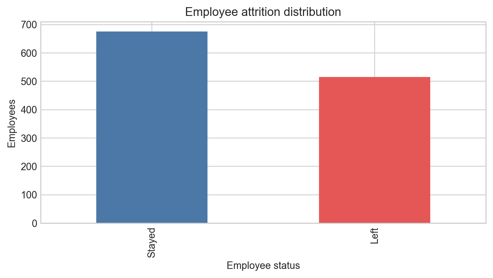
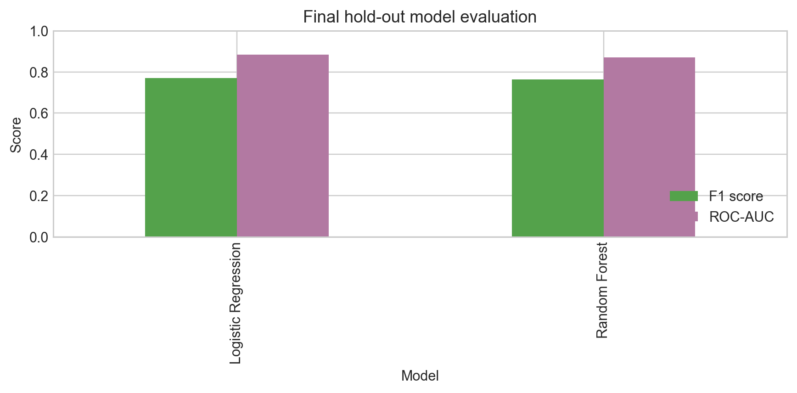
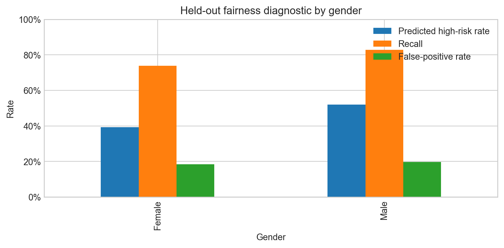
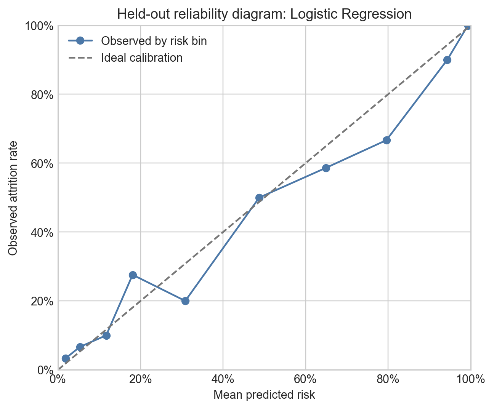

# Employee Attrition Dashboard

This academic project analyses the Saudi Employee Attrition Dataset and presents a Streamlit decision-support prototype. It includes data quality checks, employee attrition visualisations, two prediction models, repeated cross-validation, probability-calibration evidence, global feature importance, and group-level fairness diagnostics.

The dashboard also provides an adjustable high-risk threshold. To avoid presenting in-sample predictions as validation evidence, individual risk estimates are shown only for the held-out test records.

## Project pipeline

```text
Original Excel data
    -> cleaning and validation
    -> transparent dashboard fields
    -> fixed stratified train/test split
    -> five-fold cross-validation repeated five times on training data
    -> Logistic Regression and Random Forest comparison
    -> one final hold-out evaluation and calibration check
    -> global feature importance and fairness diagnostics on held-out records
    -> saved dashboard results, CSV evidence and report figures
    -> Streamlit dashboard for HR review
```

## Why these methods

- Logistic Regression is a transparent baseline.
- Random Forest can capture non-linear relationships.
- Model selection uses 5-fold, 5-repeat stratified cross-validation on the training partition. If candidates are within 0.01 mean F1, the more interpretable and maintainable model is preferred.
- The independent 25% hold-out partition is used once for final performance, calibration, fairness, permutation importance, and review-table evidence. It is not used for model selection or calibration fitting.
- Class weighting is used instead of synthetic oversampling. This avoids creating artificial employee records.
- Model pipelines fit imputation, numeric scaling, and categorical encoding only on each training fold or the final training partition.
- Permutation importance measures the effect of shuffling one feature on held-out F1. It indicates association, not causation.

## Dashboard filters and interpretation

The sidebar provides optional multi-select filters for department, gender, age group, job title, job satisfaction, overtime, years of experience, and the source dataset's salary band. Filters update the KPI cards, descriptive charts, subgroup record counts, and the held-out review table. They do not recalculate model performance, calibration, feature importance, or fairness evidence. **Clear all filters** restores the full dataset, and an empty combination displays a message instead of failing.

The high-risk threshold controls which held-out review records receive the **High risk** label. Lowering it identifies more records but can increase false alerts; raising it identifies fewer records but can miss some employees who later left. Predicted risk is a model estimate, **Left** and **Stayed** are recorded outcomes, and model outputs must not be used alone for promotion, termination, or another high-impact employment decision.

## Setup and run

Run these commands from the repository root. The local setup supports Python 3.9 or newer.

```bash
python3 -m venv .venv
source .venv/bin/activate
python -m pip install -r requirements.txt
python run_pipeline.py
python -m streamlit run app.py
```

The supplied original dataset must remain at:

```text
data/raw/Saudi Employee Attrition Dataset/Original Dataset of Employee Attrition.xlsx
```

The raw-data folder also includes the dataset key and survey questions.

## Deploy with Streamlit Community Cloud

1. Open [Streamlit Community Cloud](https://share.streamlit.io/) and sign in with GitHub.
2. Select the repository `shanakavpm/employee-attrition-dashboard`.
3. Set the main file path to `app.py` and select the branch connected to the app (currently `development`).

The dashboard loads precomputed results from `outputs/dashboard_data.json`, generated by running `python run_pipeline.py` on the original dataset. Model training, cross-validation and feature importance calculations are performed in the pipeline rather than during dashboard use. This reduces loading time and keeps the dashboard consistent with the generated report evidence. After changing the dataset or modelling code, rerun the pipeline and include the updated results when deploying.

## Evidence and key findings

Generated results are in `outputs/`, with report figures in `figures/`.

| Evidence | Current result | Interpretation |
| --- | ---: | --- |
| Records analysed | 1,191 | All available records were retained; no convenience sample was used. |
| Observed attrition rate | 43.2% | Describes this dataset only, not all employers. |
| Selected model | Logistic Regression | Selected using repeated cross-validation on training data, with an interpretability preference for operationally comparable models. |
| Repeated-CV F1 | 0.764 ± 0.031 | Logistic Regression mean and standard deviation across 25 validation folds; empirical 95% interval 0.698–0.808. |
| Repeated-CV ROC-AUC | 0.878 ± 0.024 | Empirical 95% interval 0.831–0.920. |
| Hold-out F1 | 0.771 | Useful screening performance, not a decision rule for individual employees. |
| Hold-out ROC-AUC | 0.884 | Discrimination evidence on the held-out test set. |
| Hold-out Brier score | 0.137 | Better than the training-prevalence baseline of 0.245; lower is better. |
| Mean absolute calibration gap | 0.050 | Overall calibration is reasonably close, but individual bins vary and scores remain estimates rather than guaranteed probabilities. |
| Numeric-standardisation ablation | F1 remains 0.771 | Standardisation does not explain the reported result. |









## Calibration method

The selected, already-fitted model produces risk scores for the untouched hold-out records. The pipeline reports the Brier score and groups those records into ten approximately equal-sized risk bins for a reliability diagram. Each point compares a bin's mean predicted risk with its observed attrition rate. Calibration is flagged as weak when the model does not improve on the training-prevalence Brier baseline or when the record-weighted mean absolute bin gap exceeds 0.10. No model or probability calibrator is fitted on hold-out records. Reproduce the CSV evidence in `outputs/calibration_metrics.csv` and `outputs/calibration_curve.csv`, the PNG figure, and the dashboard bundle with `python run_pipeline.py`.

## Reproducibility

The pipeline uses random state 42, a fixed 25% stratified hold-out split, and 5-fold stratified cross-validation repeated 5 times on the remaining training data. Reported 95% ranges are empirical 2.5th–97.5th percentile intervals across the 25 validation-fold scores, not confidence intervals for all possible future organisations.

Run the complete verification after regenerating evidence:

```bash
python run_pipeline.py
python -m unittest discover -s tests -v
python -m streamlit run app.py
```

## Project structure

```text
app.py                 Streamlit dashboard
run_pipeline.py        Reproducible pipeline runner
src/data.py            Loading, cleaning, validation, and dashboard fields
src/modeling.py        Modelling, evaluation, fairness, and explanations
src/dashboard_filters.py Shared filter definitions and filtering logic
src/dashboard_data.py  Save/load the portable dashboard result bundle
src/config.py          Paths and shared settings
data/raw/              Supplied original data
data/processed/        Generated clean data
outputs/               Dashboard result bundle, evidence tables and figure index
figures/               PNG figures for the report and GitHub evidence
```

## Responsible use and limitations

The dataset is survey-based and represents a limited context. It does not establish causal effects or guarantee that results generalise to another organisation. The 298-record hold-out set limits calibration and subgroup precision, and several reliability bins differ visibly from ideal calibration. The dashboard is an academic tool for human review and retention support, not an automated employment decision system. High-risk scores, feature importance, and fairness measures must be interpreted alongside record counts, data quality, organisational context, and human judgement.

## Changelog following user feedback

- Added five optional workforce filters while retaining the existing department, gender, and age filters.
- Added subgroup record counts, small-sample guidance, safer empty-filter handling, and fuller threshold help.
- Replaced hold-out-based selection with deterministic 5-fold, 5-repeat training-only cross-validation and empirical 95% score intervals.
- Added reproducible Brier-score and reliability-diagram evidence without fitting a calibrator on held-out records.
- Strengthened public explanations of filter scope, prediction labels, identifiers, fairness population, and responsible use.

## Dataset references

Alqahtani, H., Almagrabi, H. and Alharbi, A. (2025) *Saudi Employee Attrition Dataset* (Version 1) [Dataset]. Mendeley Data. Available at: https://doi.org/10.17632/6z2hty8php.1 (Accessed: 13 September 2026).

Alqahtani, H., Almagrabi, H. and Alharbi, A. (2025) ‘Dataset for predictive modelling and analysis of employee attrition and retention’, *Data in Brief*, 63, 112242. Available at: https://doi.org/10.1016/j.dib.2025.112242.
